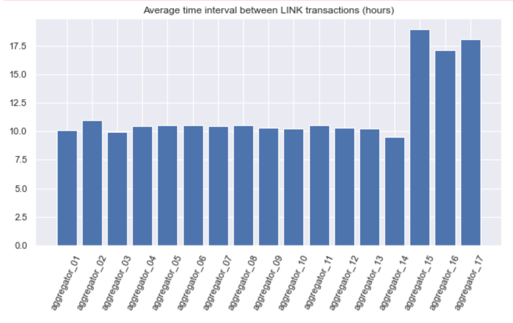
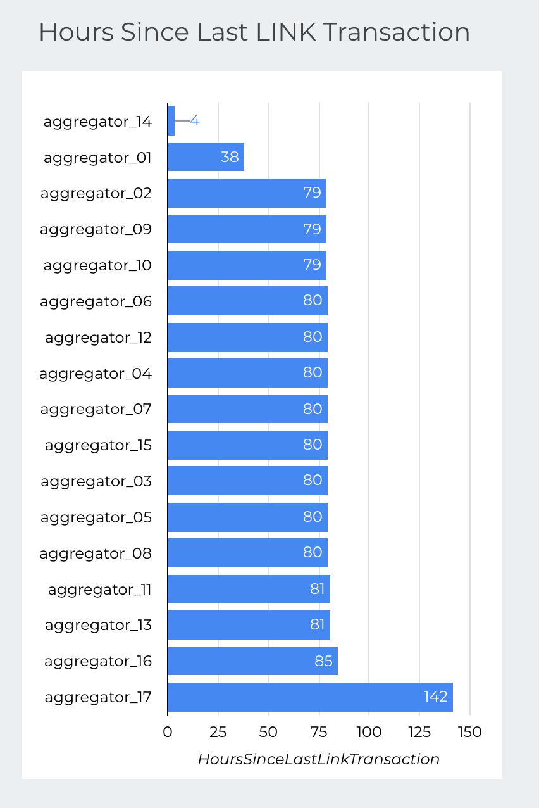

# eth-data-analysis
There is much insight to be had from mining the data published to the ethereum blockchain. In this repo, we build an ETL pipeline to pull ETH and ERC20 token data for a set of addresses, process it, then push it to BigQuery where Data Studio and easily consume it to produce a set of dynamic dashoboards.

In particular, for a set of [Chainlink Aggregator](https://docs.chain.link/docs/architecture-decentralized-model/) contract addresses, we pull normal and ERC20 transaction data. Normal transactions account for data submissions from Chainlink nodes whereas ERC20 token transfers include `LINK` token deposits and payouts.


## Dashboards
With the raw transaction data of token transfers, we can build charts to visualize account activity such as the number of transactions, amount transferred, current and running balance, and transaction fees. For live Aggregators, we need to constantly refresh the data. In contrast to normal transactions, which are frequent and include data submissions to Aggregators, there are severals hours between token transactions. For this reason, we run a data refresh on some hourly schedule.

<!--  -->


Additional charts are constructed on Data Studio to show an up to date running balance of LINK tokens for each Aggregator address, along with the amount of time in hours since the last token transaction, current balance, sum of all transactions and number of transactions broken out by inbound/outbound direction, and the transaction fee in ETH. Note that the transaction fee is quoted for multiple transfers taken place within a single transaction hash. Charts from Data Studio report follow.


<p float="left">
    
    
</p>


## ETL Architecture
The ETL cycle is shown in its entirety below.


It starts with pulling the data from the [Etherscan APIs](https://docs.etherscan.io/api-endpoints/accounts), which includes protocols to explore normal, internal, and ERC20 or ERC721 token transactions. For the list of addresses under consideration, most of the interesting data found relates to ERC20 LINK token transfers. As Chainlink nodes fulfull order requests to submit data, there is possibly useful insight to be gained from investigating the normal transactions more deeply, however Etherscan APIs do not reveal much state information.

Once the data is pulled to the local machine, it is processed in `pandas` to compute the direction of transfer, transaction fee (from gas and gas price) and the running balance.

Next we create a dataset and table in BigQuery and push the local data to the cloud using GCP [client libraries for python](https://cloud.google.com/python/docs/reference). The dashboards are then created in Data Studio after connecting the Big Query table to a report. This is all done graphically, though similar static visualizations are constructed with code in `notebooks/02-visualizations.ipynb`.

An issue with the Etherscan API is that ERC20 token requests cannot be limited by either timestamp or block height, so everytime the ETL job runs we pull the full history of transfers, only limited to the 10,000 count enforced by the API. After sending this full list of rows to Big Query, we run a query that deduplicates rows by replacing the existing table with a new one which only selects for single instances of all transaction attributes.

## Instructions
Initial development was completed through the ordered `notebooks`. These can be run in sequential order to run through the full ETL pipeline and includes `matplotlib` code to produce many of the same charts constructed in the Data Studio report. The code in the notebooks were then copied over to `scripts/data_refresh.py` for simplicity.

To schedule an hourly data refresh with `cron`, add the following to `crontab -e`:
```sh
    0 */1 * * * cd /path/to/repo/scripts && /path/to/python data_refresh.py > path/to/logs 2>&1
```
## Potential Improvements
* Automate the ETL job in an Airflow DAG
    * Easy to backfill, easy to schedule, easy to turn on/off
* At the start of each job, lookup last block height of a transaction given an account for more efficient data pull
    * Etherscan API for ERC-20 transactions doesn't seem to support this
    * Running an ethereum node would resolve this
* Normalize transaction fees for token transfers by account multiple transfers in a single token transaction.
    * This feature doesn't seem to be supported by Etherscan. The `internal` transaction API is returning empty (https://docs.etherscan.io/api-endpoints/accounts#get-internal-transactions-by-transaction-hash)
* Consider running an ethereum node to host the data rather than pulling from Etherscan to avoid limits
    * Would also allow deeper exploration of `normal` transactions and state updates which include the ability to evaluate data submissions